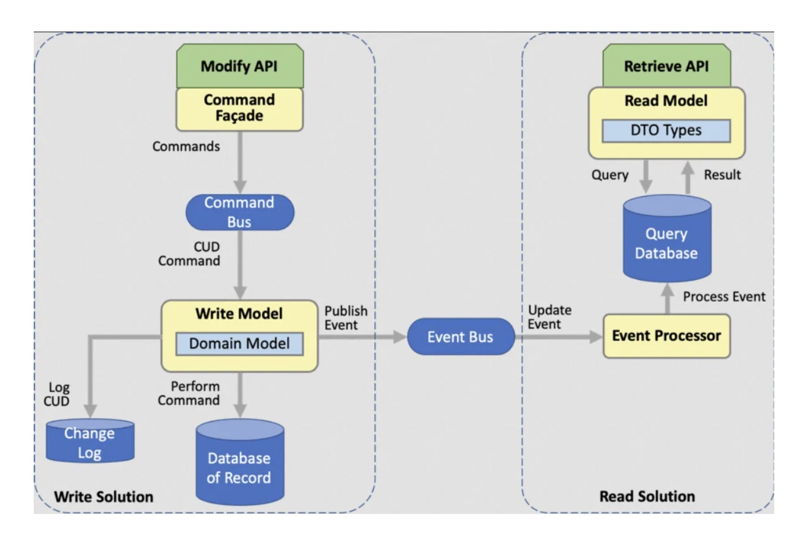

# What is CQRS (Command and Query Responsibility Segregation) Pattern in Microservices Architecture?

Why use CQRS Pattern? How does CQRS Pattern improves scalability of your Microservice architecture.

Hello folks, if you are working on Microservice architecture and wondering what is CQRS (Command and Query Responsibility Segregation) Pattern and how it can improve your Microservices architecture then you have come to the right place.

In the last few articles I have talked about essential Microservice design patterns like Event Sourcing, SAGA, Database Per Microservices, API Gateway, Circuit-Breaker and also shared best practices to design Microservices and in this article, I will tell you everything about CQRS pattern which I know like what it is, how does it work, what are pros and cons of this pattern and also how does it impact your Microservices architecture.

In last few years, Microservices architecture has gained immense popularity due to its ability to enable scalability, maintainability, and agility in modern application development.

However, managing the complexity and coordination of microservices can be challenging. This is where the CQRS (Command Query Responsibility Segregation) pattern comes into play.

CQRS is a Microservice design pattern that separates the read and write operations of an application, allowing for independent scaling, optimization, and handling of data.

In this article, we will explore how CQRS can improve your Microservice architecture by providing clear separation of concerns, enabling optimized read and write operations, and improving overall system performance.

Whether you are new to microservices or already using them, understanding the benefits of CQRS can help you design more efficient and scalable Microservice-based applications.

And, if you are not a Medium member then I highly recommend you to join Medium and read great stories from great authors from real field. You can join Medium here

Join Medium with my referral link - Soma
Read this and every story from thousands of great writers on Medium). Read more from great writers on Medium like…
medium.com

What is Command Query Responsibility Segregation Pattern? How does CQRS Pattern Works?
The Command Query Responsibility Segregation (CQRS) pattern is a design pattern that separates the responsibilities of handling read (query) and write (command) operations in an application.

In a traditional architecture, a single model is used for both read and write operations, which can result in challenges when it comes to scalability, performance, and maintenance.

CQRS addresses these challenges by splitting the application’s responsibilities into separate models, with one model optimized for handling read operations and another for handling write operations.

The basic idea behind CQRS is to treat commands (operations that change state) and queries (operations that retrieve data) differently. Commands are used to perform actions that modify the state of the system, such as creating, updating, or deleting data. Queries, on the other hand, are used to retrieve data from the system without modifying its state.

CQRS typically involves the use of separate data models or databases for read and write operations. The read model is designed to be optimized for fast and efficient retrieval of data, often denormalized and tailored for specific query requirements.

The write model, on the other hand, focuses on capturing the changes to the system state in a transactional manner, ensuring data consistency and integrity.

CQRS also often involves the use of asynchronous messaging and event sourcing to handle the communication and coordination between the read and write models. Commands are used to trigger actions in the write model, which then generates events that are processed by the read model to update its data.

By separating the responsibilities of handling read and write operations, CQRS can provide several benefits for microservice architecture, including improved scalability, performance, maintainability, and flexibility.

But as they said, there is no free lunch and CQRS is no exception. For all those benefits it also introduces complexities in terms of coordination, consistency, and eventual consistency that need to be carefully addressed in the design and implementation of the system.

What problem is solved by CQRS pattern in Microservices Architecture? Example
CQRS (Command Query Responsibility Segregation) is a pattern that helps solve several challenges in designing and implementing complex systems. First of all, it allows for separate optimization of read and write operations, improving scalability and performance.

It also promotes separation of concerns, making code cleaner and more maintainable. It enables event-driven architecture and supports different consistency models.

It also facilitate for independent evolution of the read and write models, improving fault tolerance and evolvability.

Overall, CQRS helps to address various issues in microservice architecture and aligns with domain-driven design principles, making it a valuable pattern for building robust and scalable systems.

Let’s consider an e-commerce application like Amazon or FlipKart that handles a large number of concurrent user requests. The application allows users to browse products, add items to the cart, place orders, and view order history.

With traditional CRUD-based architecture, the same database and model are used for both read and write operations. As the application grows, the database becomes a bottleneck due to contention and performance issues. Scaling the application becomes challenging as read-heavy operations compete with write-heavy operations for database resources.

By implementing the CQRS pattern, you can segregate the read and write operations. We can create separate read models optimized for query performance, such as using materialized views or caching, to provide fast and scalable read operations. The write operations can use a different model optimized for write performance, such as using event sourcing or command-based processing.

This separation of concerns allows us to independently scale the read and write components of the system, improving performance and scalability. It also enables us to evolve the read and write models independently, providing flexibility for future changes or enhancements.

Overall, by adopting the CQRS pattern, we can enhance the microservice architecture of our e-commerce application, improving performance, scalability, and maintainability.

Here is a nice diagram which explains how CQRS pattern works in Microservices architecture:

In the diagram, the client (e.g., an e-commerce application) interacts with both the read model and the write model. The read model is optimized for fast and scalable reads, providing efficient querying of data for read-heavy operations. The write model is optimized for efficient writes, handling commands or events for write-heavy operations.

The separation of the read and write models allows for independent scaling of these components, providing better performance and scalability. The client can send queries to the read model for fast and optimized reads, while commands or events are sent to the write model for efficient writes.

This separation of concerns helps to alleviate contention and performance issues in the database, leading to a more scalable and performant microservice architecture.

How does CQRS Pattern Improves Microservice Architecture? 10 Benefits of CQRS Pattern
The Command Query Responsibility Segregation (CQRS) pattern can improve microservice architecture in several ways:

1. Scalability
   CQRS improve scalability by separating read and write operations into separate models or databases. This means that read-heavy operations can be optimized for performance without impacting the write-heavy operations. Microservices can scale independently based on their specific requirements, leading to better overall system scalability.

2. Performance
   CQRS enables optimized data retrieval in the read model, as it can be de-normalized and tailored for specific query requirements. This can result in faster and more efficient data retrieval, improving the performance of the system.

3. Flexibility
   CQRS provides flexibility in the design and implementation of microservices. It allows for different data models or databases for read and write operations, which can be chosen based on the specific needs of each microservice. This flexibility allows for better alignment of data storage and retrieval strategies with the unique requirements of each microservice.

4. Maintainability
   CQRS promotes separation of concerns by clearly defining the responsibilities of handling read and write operations. This can lead to cleaner and more maintainable code, as the logic for each type of operation is isolated and can be independently updated or modified without impacting other parts of the system.

5. Event-driven architecture
   CQRS often involves the use of asynchronous messaging and event sourcing, which can enable event-driven architecture in microservices. Events can be used to communicate changes in the system and trigger actions in different microservices. This can result in loosely coupled and decoupled microservices that can evolve independently, making the system more resilient and adaptable to changes.

6. Consistency
   CQRS allows for different consistency models for read and write operations. For example, write operations can be designed to ensure transactional consistency, while read operations can be designed for eventual consistency. This can enable better trade-offs between consistency and performance, depending on the requirements of each microservice.

7. Separation of concerns
   CQRS promotes separation of concerns by clearly defining the responsibilities of handling read and write operations. This can lead to better modularity, easier testing, and improved maintainability of microservices.

8. Improved fault tolerance
   CQRS can enable better fault tolerance in microservices. For example, if the write model or database is experiencing issues, the read model can still function independently, providing a degraded but still usable service.

9. Evolvability
   CQRS allows for independent evolution of the read and write models, as they are decoupled from each other. This enables easier upgrades, changes, and enhancements to each model without impacting the other, improving the evolvability of the system.

10. Domain-driven design (DDD)
    CQRS aligns well with the principles of Domain-driven Design (DDD), where the domain model is at the core of the system’s design. CQRS allows for better modeling of the domain by separating read and write operations and providing flexibility in data storage and retrieval strategies.

Overall, CQRS can help improve microservice architecture by providing scalability, performance, flexibility, maintainability, event-driven architecture, consistency, separation of concerns, fault tolerance, evolvability, and alignment with domain-driven design principles.

You can combine CQRS Pattern with Event Sourcing, Asynchronous Communication using Message Broker and API Gateway to create a better Microservice architecture.

Java and Spring Interview Preparation Material
Before any Java and Spring Developer interview, I always use to read the below resources

Grokking the Java Interview

Grokking the Java Interview: click here

I have personally bought these books to speed up my preparation.

You can get your sample copy here, check the content of it and go for it

Grokking the Java Interview [Free Sample Copy]: click here

If you want to prepare for the Spring Boot interview you follow this consolidated ebook, it also contains microservice questions from spring boot interviews.

Grokking the Spring Boot Interview

You can get your copy here — Grokking the Spring Boot Interview

Conclusion
That’s all about what is CQRS Pattern in Microservices architecture and how it changes your application structure and performance. As we have seen in this article the CQRS (Command and Query Responsibility Segregation) pattern can greatly improve your microservice architecture by addressing challenges related to scalability, performance, and separation of concerns.

By separating the read and write models, CQRS allows for optimized and independent scaling of these components, leading to better performance and scalability. CQRS Pattern also enables efficient handling of read-heavy and write-heavy operations, reducing contention and performance issues in the database.

Implementing CQRS can result in a more robust, scalable, and performant microservice architecture, making it a valuable pattern for building modern distributed systems.

Remember, your application is always either read-heavy or write heavy, I have never meet an application which has balanced read or write load. So, there is always a chance that it will only improve your Microservices architecture.

If you like this Microservice article and want to read more such article but you are not a Medium member then I highly recommend you to join Medium and many such articles from many Java and Microservice experts.
