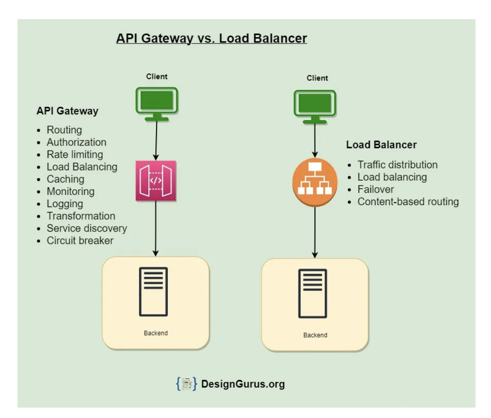

# General Articles

## SOLID 

SOLID is an acronym that stands for five key design principles: single responsibility principle, open-closed principle, Liskov substitution principle, interface segregation principle, and dependency inversion principle. All five are commonly used by software engineers and provide some important benefits for developers.

### Single Responsibility Principle
Robert Martin summarizes this principle well by mandating that, “a class should have one, and only one, reason to change.”

### Open-close principle
Martin summarizes this principle, “You should be able to extend a class’s behavior without modifying it.”
- Open for extension, meaning that the class’s behavior can be extended; and
- Closed for modification, meaning that the source code is set and cannot be changed.
how: Using inheritance or interfaces that allow polymorphic substitutions is a common way to comply with this principle. Regardless of the method used, it’s important to follow this principle in order to write code that is maintainable and revisable.

### Liskov Substitution Principle
his principle simply requires that every derived class should be substitutable for its parent class
it’s a way of ensuring that derived classes extend the base class without changing behavior.
Extends the derived class but the behavior has to be the same than the parent class.

### Interface Segregation Principle
it’s better to have a lot of smaller interfaces than a few bigger ones. Martin explains this principle by advising, “Make fine grained interfaces that are client-specific. Clients should not be forced to implement interfaces they do not use.”

### Dependency Inversion Principle
depend on abstractions, not on concretions
“abstractions should not depend on details. Details should depend upon abstractions.”

# Difference Between API Gateway and Load Balancer

